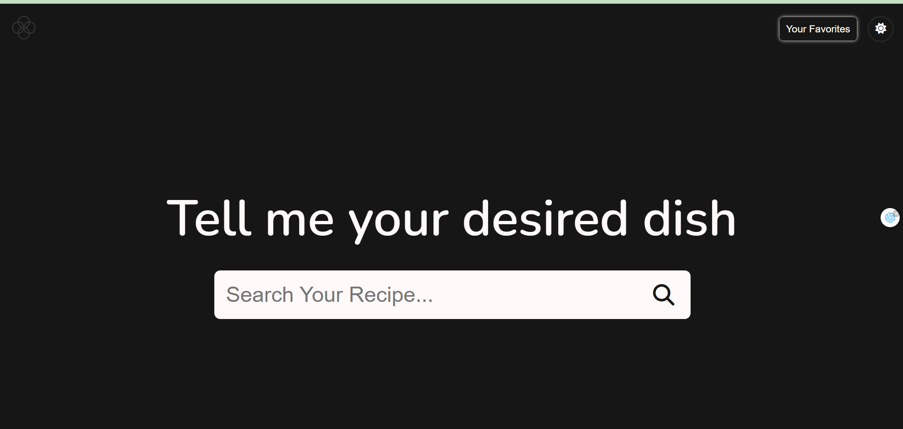
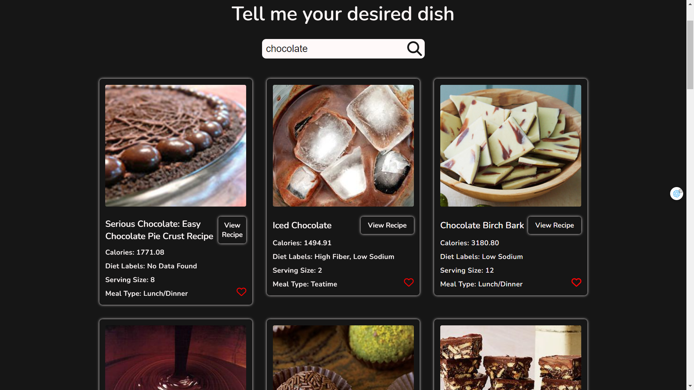
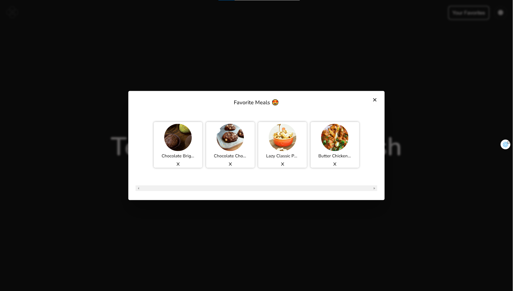
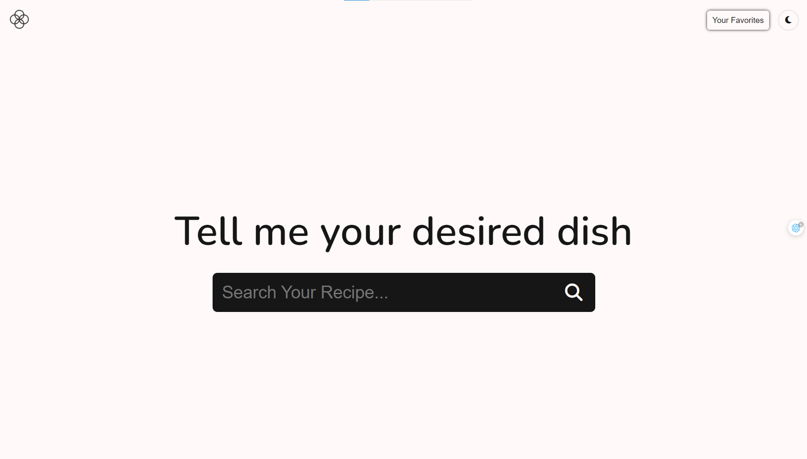

# Recipe App

## Welcome! 👋

Thanks for checking out this recipe app.

With this app you can explore recipes from your main ingredient, save recipes to your favorite meals for later uses.

## Table of contents

- [Overview](#overview)
  - [The challenge](#the-challenge)
  - [Screenshot](#screenshot)
  - [Links](#links)
- [My process](#my-process)
  - [Built with](#built-with)
  - [What I learned](#what-i-learned)
  - [Deploying Sites](#deploying_projects)

## Overview

### The challenge

Users should be able to:

- Find recipes based on what their input in the search bar
- Save their favorite recipes and store them inside Favorite's tab for them to view later
- Change the theme's color dynamically once the button is clicked.
- Fetch more recipe when users want to find more recipe (if any).

### Screenshot

#### Main page

#### Exploring recipes

#### Favorite Sections

#### Dark-Light Theme

##### Dark Theme

##### Light Theme

### Links

- Live Site URL: [Live site URL here](https://recipeapp-phu.netlify.app/)

## My process

### Built with

- HTML/CSS
- Flexbox
- CSS Grid
- REST API (EDAMAM API)
- Local Storage

### What I learned

With this project, I am able to learn about fetching and handling API and manipulate Local Storage to store specific meal IDs to create Favorite Section for users as well as hone my front-end skills using Flex Box and Grid.

## Deploying your project

Tp try something new, I used netlify to host my project instead of github.

- [GitHub Pages](https://pages.github.com/)
- [Netlify](https://www.netlify.com/)
